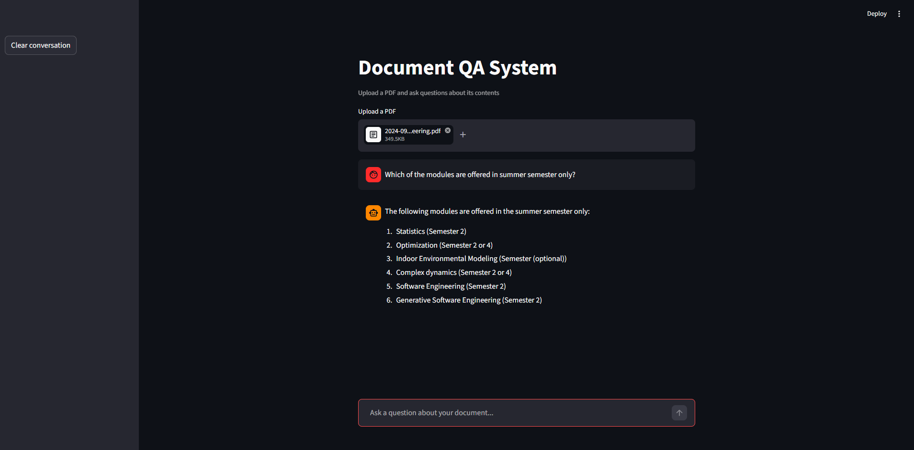

# RAG Document QA System

A retrieval-augmented generation (RAG) system that lets you upload any PDF and ask questions about it in a conversational interface. Built with LangChain, FAISS, Groq, and Streamlit.



---

## How it works

1. Upload a PDF through the web interface
2. The document is split into chunks and converted to vector embeddings
3. Embeddings are stored locally in a FAISS vector database
4. When you ask a question, the most relevant chunks are retrieved
5. A Groq LLM generates an answer grounded in the document content
6. Full chat memory — follow-up questions are context-aware

```
PDF → Chunking → Embeddings (HuggingFace) → FAISS
                                                 ↓
Question → Retrieval → Prompt + History → Groq LLM → Answer
```

---

## Tech stack

| Component | Tool |
|---|---|
| Orchestration | LangChain |
| Embeddings | HuggingFace `all-MiniLM-L6-v2` |
| Vector store | FAISS |
| LLM | Groq (`llama-3.1-8b-instant`) |
| UI | Streamlit |
| PDF loading | PyPDF |

---

## Run locally

**1. Clone the repo**
```bash
git clone https://github.com/alihyder3/rag-document-qa.git
cd rag-document-qa
```

**2. Create a virtual environment**
```bash
python -m venv venv
source venv/bin/activate  # Windows: venv\Scripts\activate
```

**3. Install dependencies**
```bash
pip install -r requirements.txt
```

**4. Set up environment variables**
```bash
cp .env.example .env
# Add your GROQ_API_KEY to .env
```

**5. Run the app**
```bash
python -m streamlit run app/main.py
```

---

## Project structure

```
rag-document-qa/
├── app/
│   ├── ingest.py       # PDF loading, chunking, embedding
│   ├── qa_chain.py     # Retrieval chain with chat memory
│   └── main.py         # Streamlit UI
├── data/
│   └── sample_docs/    # Place your PDFs here
├── tests/
│   └── test_qa.py
├── .env.example
└── requirements.txt
```

---

## Features

- Upload any PDF and start asking questions immediately
- Conversational memory — ask follow-up questions naturally
- Fully local vector store — no external database needed
- Free to run — uses Groq's free API tier and HuggingFace embeddings

---

## Get a free Groq API key

Sign up at [console.groq.com](https://console.groq.com) — no credit card required.